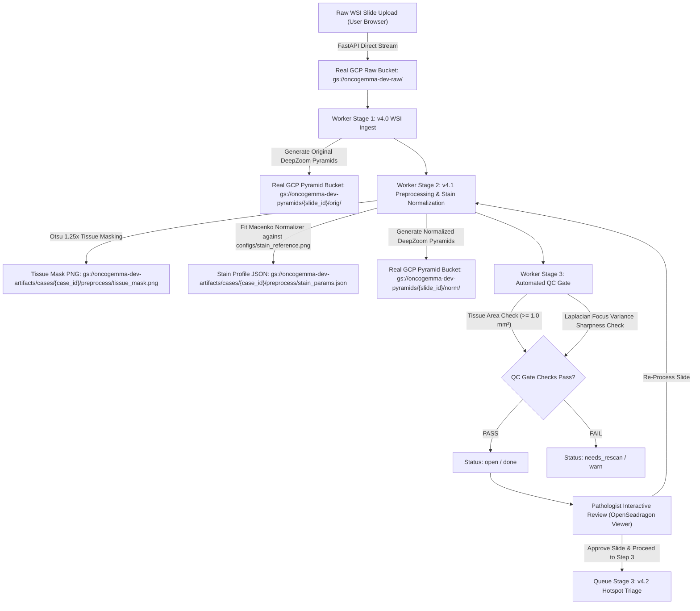

# OncoGemma Stage v4.1: Preprocessing & Automated QC Gate

OncoGemma is an enterprise-grade AI diagnostic platform for automated Whole-Slide Image (WSI) processing and Nottingham Histological Grading of invasive breast carcinoma.

This repository branch (`v4.1-preprocess-qc`) implements **Stage v4.1 (Preprocessing + QC Gate)**, establishing authentic Whole-Slide Image ingestion, Macenko stain normalization, tissue coverage check, focus quality gate, Real GCP Cloud Storage integration, and interactive Pathologist verification controls.

---

## 🏗️ Architecture & Pipeline Overview

Stage v4.1 processes raw whole-slide images (`.svs`, `.ndpi`, `.tiff`, `.tif`, `.jpg`, `.png`) through a multi-stage background worker pipeline:



---

## 🚀 Key Features Implemented in v4.1

### 1. Real Google Cloud Storage Integration
* All raw Whole-Slide Images, multi-resolution DZI tile pyramids, and stage output reports are persisted directly to **Google Cloud Storage (GCP)** buckets:
  * `gs://oncogemma-dev-raw` — Raw whole-slide images (`.svs`, `.ndpi`, `.tiff`, `.jpg`).
  * `gs://oncogemma-dev-pyramids` — Original (`orig/`) and Normalized (`norm/`) DeepZoom tile trees.
  * `gs://oncogemma-dev-artifacts` — Preprocess stain parameters, tissue masks, and QC reports.

### 2. Macenko Stain Normalization & Vector Alignment
* Fits Macenko stain parameters (`PureNumpyMacenkoNormalizer`) against `configs/stain_reference.png`.
* **Stain Vector Alignment**: Strictly assigns Hematoxylin (Row 0: high $OD_R / OD_G$ ratio) and Eosin (Row 1: high $OD_G / OD_R$ ratio).
* **Non-Negative Concentration Clamping**: Enforces $c_{\text{src}} \ge 0$ to prevent negative OD exponent overflow and white center tissue distortions.

### 3. On-The-Fly Patch Normalization Strategy for Downstream AI
* Saves `stain_params.json` in GCS (`gs://oncogemma-dev-artifacts/cases/{case_id}/preprocess/stain_params.json`).
* Downstream AI stages (**v4.2 Hotspot Triage**, **v4.3 Mitosis Counting**, **v4.4 Nottingham Grade**) load `stain_params.json` to normalize extracted $512 \times 512$ candidate patches on-the-fly in $<5\text{ms}$ per patch, avoiding $10+\text{ GB}$ of redundant tile storage per slide.

### 4. Interactive Pathologist Approval & Re-Processing Controls
* **Auto-Advancing Workflow Rail**: Automatically advances to Step 2 (**v4.1 Stain & QC Gate**) as soon as WSI ingest completes.
* **Approve Slide & Proceed to Step 3**: Pathologist approves slide stain quality, marking Stage 2 as confirmed and triggering Stage 3 (**v4.2 Hotspot Triage**).
* **Re-Process Slide**: Pathologist re-queues Macenko stain normalization and QC gate processing from scratch.

---

## 🛠️ API Endpoints Summary

| Method | Endpoint | Description |
| :--- | :--- | :--- |
| `GET` | `/api/v1/cases` | List diagnostic cases |
| `POST` | `/api/v1/cases` | Create new diagnostic case |
| `POST` | `/api/v1/cases/{case_id}/slide/upload` | Upload raw whole-slide image to Real GCP Storage |
| `GET` | `/api/v1/cases/{case_id}/tiles/{layer}/{z}/{filename}` | Stream DZI pyramid tile (`orig` or `norm`) directly from GCP |
| `POST` | `/api/v1/cases/{case_id}/stages/{stage_name}/approve` | Pathologist approves stage output & queues Stage 3 (Triage) |
| `POST` | `/api/v1/cases/{case_id}/stages/{stage_name}/retry` | Re-queue pipeline stage execution attempt |

---

## 💻 Installation & Quickstart

### Prerequisites
* Python 3.10+
* Node.js 18+ & npm
* Active Google Cloud Storage credentials (`gcloud auth application-default login` or ADC service account)

### Backend Setup
```bash
cd backend
python -m venv venv
# On Windows:
venv\Scripts\activate
# On Linux/macOS:
source venv/bin/activate

pip install -r requirements.txt
uvicorn app.main:app --host 127.0.0.1 --port 8000
```

### Worker Setup
In a separate terminal:
```bash
cd backend
python -m worker.main
```

### Frontend Setup
In a separate terminal:
```bash
cd frontend
npm install
npm run dev
```

Open **[http://localhost:3000/cases](http://localhost:3000/cases)** in your browser to view the live platform!

---

## 📄 Verification & Testing

Run unit tests for stain normalization and QC checks:
```bash
pytest backend/tests
```

Run end-to-end real GCP upload and pipeline test:
```bash
python scratch/test_real_upload.py
```
