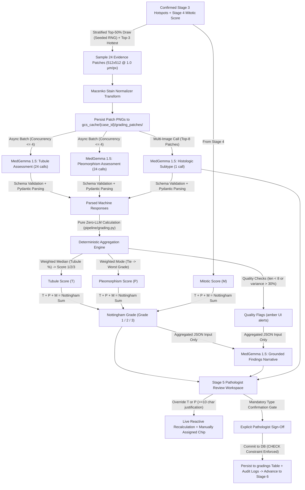

# OncoGemma Stage v4.4: Nottingham Histologic Grading & Architectural Synthesis (MedGemma 1.5)

OncoGemma is an enterprise-grade clinical AI copilot for automated Whole-Slide Image (WSI) processing, hotspot triage, and Nottingham Histological Grading of invasive breast carcinoma.

This repository branch (`v4.4-nottingham-grading`) implements **Stage v4.4 (Nottingham Histological Grading via MedGemma 1.5 & Pure Zero-LLM Aggregation)**, combining cell-level mitotic counts from Stage v4.3 with automated architectural analysis across 24 normalized $10\times$ evidence patches to establish Tubule Formation, Nuclear Pleomorphism, CAP Histologic Subtype, and live Nottingham Grade.

---

## 🏗️ Pipeline Architecture Flow



---

## 📋 Implementation Plan & Mathematical Specification

### 1. Tubule Formation Scoring
- Evaluated across all patches where `tumor_present == True`:
  $$\text{Tubule } \% = \text{WeightedMedian}\left(\{\text{tubule\_percent}_i\}, w_i\right) \quad \text{where } w_i = \{ \text{low}: 0.5, \text{medium}: 1.0, \text{high}: 1.5 \}$$
- Nottingham sub-score mapping:
  $$\text{Tubule Score} = \begin{cases} 1 & \text{if } \text{Tubule } \% > 75.0\% \\ 2 & \text{if } 10.0\% \le \text{Tubule } \% \le 75.0\% \\ 3 & \text{if } \text{Tubule } \% < 10.0\% \end{cases}$$

### 2. Nuclear Pleomorphism Scoring
- Evaluated across 24 patches:
  $$\text{Pleomorphism Score} = \text{WeightedMode}\left(\{\text{pleomorphism\_score}_i\}, w_i\right)$$
- **Conservative Tie-Breaking Rule**: In the event of a tie in weighted votes, the higher score is assigned (conservative clinical bias favoring the worse grade).

### 3. Nottingham Histological Grade Synthesis (Zero-LLM Guard)
- Pure integer sum:
  $$\text{Nottingham Sum} = \text{Tubule Score} + \text{Pleomorphism Score} + \text{Mitotic Score}$$
- Final grade determination:
  $$\text{Nottingham Grade} = \begin{cases} 1\ (\text{Well Differentiated}) & \text{if } 3 \le \text{Nottingham Sum} \le 5 \\ 2\ (\text{Moderately Differentiated}) & \text{if } 6 \le \text{Nottingham Sum} \le 7 \\ 3\ (\text{Poorly Differentiated}) & \text{if } 8 \le \text{Nottingham Sum} \le 9 \end{cases}$$

### 4. Database Invariant & Guard
Enforced directly via PostgreSQL / SQLite `CHECK` constraint in `backend/app/models/grading.py`:
```sql
CREATE TABLE gradings (
  case_id uuid PRIMARY KEY REFERENCES cases(id),
  tubule_percent real, tubule_score int, pleo_score int,
  mitotic_score int, nottingham_sum int, grade int,
  histologic_type text NOT NULL, type_confirmed_by text NOT NULL,
  machine jsonb NOT NULL, overrides jsonb NOT NULL DEFAULT '{}',
  CHECK (grade = CASE WHEN tubule_score+pleo_score+mitotic_score <= 5 THEN 1 
                      WHEN tubule_score+pleo_score+mitotic_score <= 7 THEN 2 
                      ELSE 3 END)
);
```

### 5. Versioned Prompts with SHA-256 Tracking
Prompt templates stored in `configs/prompts/*.md`:
- `tubule@v1.md`: Structured per-patch glandular/tubular percentage estimation.
- `pleo@v1.md`: Structured nuclear atypia, chromatin texture, and nucleolar prominence grading.
- `histologic_type@v1.md`: Multi-image consensus classification across top 8 patches.
- `findings_narrative@v1.md`: Diagnostic summary receiving strictly finalized JSON numbers.

---

## 🔍 Walkthrough & Key Deliverables

### 1. Zero-LLM Aggregation Engine (`backend/pipeline/grading.py`)
- Complete deterministic computation with zero LLM math hallucinations.
- Invariant validation protecting against corrupted inputs.
- Automated quality flags (`insufficient_tumor_patches`, `pleo_high_variance`).

### 2. MedGemma 1.5 Client (`backend/pipeline/medgemma.py`)
- Async semaphore concurrency limiter (`concurrency <= 4`).
- Pydantic schema validation with automatic 2x retry loop on malformed outputs.
- Graceful fallback to `needs_human: true`.

### 3. Stage 5 Worker Handler (`backend/worker/grading.py`)
- Deterministic stratified sampling of 24 normalized $10\times$ evidence patches ($512 \times 512$ px @ $1.0\ \mu\text{m/px}$).
- Macenko stain normalization and local disk/cloud streaming.

### 4. Stage 5 REST API Router (`backend/app/routers/grading.py`)
- `GET /api/v1/stages/grading/{case_id}`: Full Stage 5 payload.
- `GET /api/v1/stages/grading/{case_id}/patches/{patch_id}/image`: Streams normalized 512×512 evidence patch PNG.
- `POST /api/v1/stages/grading/recompute`: Live debounced preview of sum and grade on override changes (<10ms execution).
- `POST /api/v1/stages/grading/confirm`: Enforces mandatory type confirmation gate, validates $\ge 10$-character override justification, persists final grading, and queues Stage 6.

### 5. Pathologist Review Workspace (`frontend/components/viewer/GradingReviewWorkspace.tsx`)
- **3 Sub-score Cards**:
  - Tubule card with derived %, score (1/2/3), mini-histogram, and override selector.
  - Pleomorphism card with per-patch votes, morphometry rationales, and override selector.
  - Mitotic count card (read-only summary from Stage 4 + "Reopen Stage 4 Review" link).
- **CAP Histologic Subtype Card (Mandatory Gate)**:
  - Proposed subtype pill, differential tags, and AI rationale.
  - Mandatory "Confirm Histologic Subtype" gate that keeps "Confirm Stage 5" button locked until explicitly acted upon.
- **Overall Grade Card**:
  - Live reactive formula display: `T + P + M = Sum -> Grade (I / II / III)`.
  - Dynamic "Manually Assigned" chips on overridden components.
  - Grounded diagnostic summary narrative.
- **24 Evidence Patches Modal**:
  - High-resolution gallery displaying all 24 normalized patches with per-patch predictions.

---

## 🧪 Verification & Validation Results

### 1. Automated Backend Test Suite
Executed the entire backend test suite:
```bash
pytest backend/tests/ -v
```
**Result: 46/46 Passed (100% Pass Rate)**
- `test_weighted_median_basic` ✅ PASSED
- `test_weighted_mode_and_tie_breaking` ✅ PASSED (asserts ties favor worse grade)
- `test_tubule_boundary_cutoffs` ✅ PASSED (boundary values 75.1, 75.0, 10.0, 9.9)
- `test_exhaustive_27_grade_combinations` ✅ PASSED (all 27 combinations match exact Nottingham Grade)
- `test_invariant_validation_failure` ✅ PASSED (asserts ValueError on any invariant violation)
- `test_aggregate_grading_findings_flow` ✅ PASSED
- `test_database_check_constraint_enforcement` ✅ PASSED (inconsistent row insertion rejected by DB)
- `test_grading_api_full_workflow` ✅ PASSED (tested GET, recompute, blocked confirmation on missing type confirmation, blocked confirmation on short justification, and successful confirmation)
- All 38 existing tests for Stages 1–4 ✅ PASSED

### 2. Next.js Frontend Production Build
```bash
cd frontend && npm run build
```
**Result: Exit Code 0 (100% Clean Build)**

---

## 🚀 How to Run Locally

1. **Start Backend Server**:
   ```bash
   cd backend
   python run_server.py
   ```
2. **Start Background Worker**:
   ```bash
   cd backend
   python worker/main.py
   ```
3. **Start Web Frontend**:
   ```bash
   cd frontend
   npm run dev
   ```
4. Open **http://localhost:3000** in your browser.
