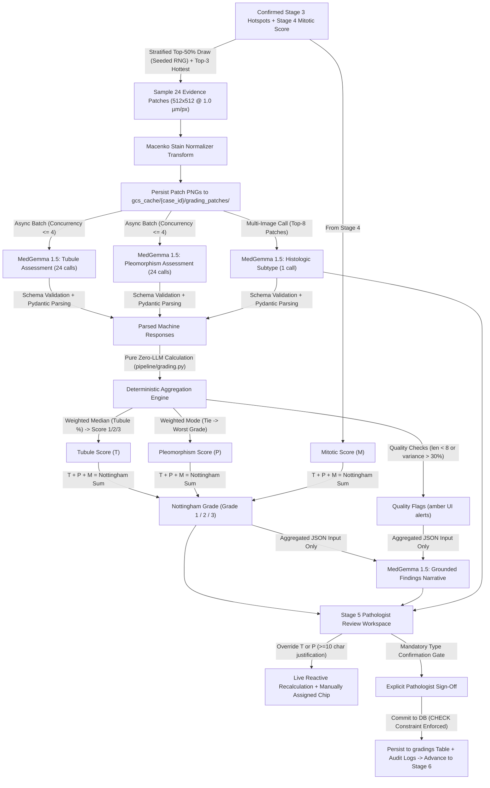

# OncoGemma Stage v4.4: Nottingham Histologic Grading & Architectural Synthesis (MedGemma 1.5)

OncoGemma is an enterprise-grade clinical AI copilot for automated Whole-Slide Image (WSI) processing, hotspot triage, and Nottingham Histological Grading of invasive breast carcinoma.

This repository branch (`v4.4` / `v4.4-nottingham-grading`) implements **Stage v4.4 (Nottingham Histological Grading via MedGemma 1.5 & Pure Zero-LLM Aggregation)**, combining cell-level mitotic counts from Stage v4.3 with automated architectural analysis across 24 normalized $10\times$ evidence patches to establish Tubule Formation, Nuclear Pleomorphism, CAP Histologic Subtype, and live Nottingham Grade.

---

## 🏗️ Architecture & Pipeline Overview



---

## 🔬 Mathematical Specification & Invariants

### 1. Tubule Formation
- Filtered to tumor-containing patches:
  $$\text{Tubule } \% = \text{WeightedMedian}\left(\{\text{tubule\_percent}_i\}, w_i\right) \quad \text{where } w_i = \{ \text{low}: 0.5, \text{medium}: 1.0, \text{high}: 1.5 \}$$
- Nottingham sub-score mapping:
  - **Score 1**: $> 75\%$
  - **Score 2**: $10\% - 75\%$
  - **Score 3**: $< 10\%$

### 2. Nuclear Pleomorphism
- Conservative mode across 24 patches:
  $$\text{Pleomorphism Score} = \text{WeightedMode}\left(\{\text{pleomorphism\_score}_i\}, w_i\right)$$
- **Tie-Breaking Rule**: Ties resolve strictly to the higher score (conservative clinical bias favoring the worse grade).

### 3. Nottingham Histological Grade Synthesis (Zero-LLM Guard)
- Pure integer sum:
  $$\text{Nottingham Sum} = \text{Tubule Score} + \text{Pleomorphism Score} + \text{Mitotic Score}$$
- Final grade determination:
  - **Grade 1 (Well Differentiated)**: Sum $3 - 5$
  - **Grade 2 (Moderately Differentiated)**: Sum $6 - 7$
  - **Grade 3 (Poorly Differentiated)**: Sum $8 - 9$

### 4. Database Invariant & Guard
Enforced directly via PostgreSQL / SQLite `CHECK` constraint:
```sql
CHECK (grade = CASE WHEN tubule_score + pleo_score + mitotic_score <= 5 THEN 1 
                    WHEN tubule_score + pleo_score + mitotic_score <= 7 THEN 2 
                    ELSE 3 END)
```

---

## 🛠️ Key REST API Endpoints

| Method | Endpoint | Description |
| :--- | :--- | :--- |
| `GET` | `/api/v1/stages/grading/{case_id}` | Retrieve complete Stage 5 state (patches, machine sub-scores, histologic type, narrative, overrides, grade) |
| `GET` | `/api/v1/stages/grading/{case_id}/patches/{id}/image` | Stream 512×512 normalized evidence patch PNG |
| `POST` | `/api/v1/stages/grading/recompute` | Live debounced sub-score preview endpoint (<10ms execution) |
| `POST` | `/api/v1/stages/grading/confirm` | Clinical safety gate, validates mandatory type confirmation & justifications, persists final grading, queues Stage 6 |

---

## 🧪 Verification & Automated Testing

Run the full test suite (46 tests):
```bash
pytest backend/tests/ -v
```

Build the Next.js frontend:
```bash
cd frontend
npm run build
```
