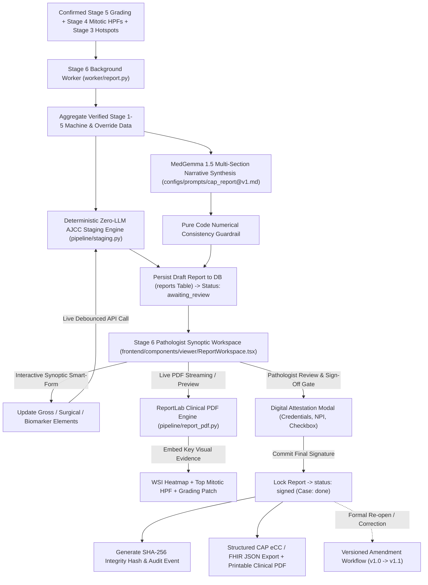

# OncoGemma Stage v4.5: CAP-Compliant Synoptic Reporting & AJCC Staging (MedGemma 1.5)

OncoGemma is an enterprise-grade clinical AI copilot for automated Whole-Slide Image (WSI) processing, hotspot triage, Nottingham Histological Grading, and standardized CAP-compliant synoptic surgical pathology reporting for invasive breast carcinoma.

This repository branch (`v4.5-cap-reporting`) implements **Stage v4.5 (CAP-Compliant Reporting via Pure Zero-LLM AJCC Staging, MedGemma 1.5 Narrative Synthesis & ReportLab Clinical PDF Generation)**, synthesizing confirmed histologic grading from Stage v4.4, mitotic counts from Stage v4.3, and hotspot triage from Stage v4.2 alongside surgical, gross, and biomarker data into standard College of American Pathologists (CAP) Cancer Protocol checklists.

---

## 🏗️ Pipeline Architecture Flow



---

## 📋 Mathematical Specification & Staging Invariants

### 1. Pure Zero-LLM Pathologic T (pT) Staging
$$\text{pT} = \begin{cases} 
\text{pTis} & \text{if in situ only} \\
\text{pT1mi} & \text{if } 0.0 < \text{size\_mm} \le 1.0 \\
\text{pT1a} & \text{if } 1.0 < \text{size\_mm} \le 5.0 \\
\text{pT1b} & \text{if } 5.0 < \text{size\_mm} \le 10.0 \\
\text{pT1c} & \text{if } 10.0 < \text{size\_mm} \le 20.0 \\
\text{pT2} & \text{if } 20.0 < \text{size\_mm} \le 50.0 \\
\text{pT3} & \text{if } \text{size\_mm} > 50.0 \\
\text{pT4a/b/c} & \text{if chest wall extension and/or skin ulceration}
\end{cases}$$

### 2. Pathologic N (pN) Staging
$$\text{pN} = \begin{cases}
\text{pNX} & \text{if nodes not examined (biopsy)} \\
\text{pN0} & \text{if } \text{positive\_nodes} = 0 \\
\text{pN1mi} & \text{if micrometastasis only } (0.2\text{ mm} - 2.0\text{ mm}) \\
\text{pN1a} & \text{if } 1 \le \text{positive\_nodes} \le 3 \\
\text{pN2a} & \text{if } 4 \le \text{positive\_nodes} \le 9 \\
\text{pN3a} & \text{if } \text{positive\_nodes} \ge 10
\end{cases}$$

### 3. Anatomic Stage Grouping
$$\text{Stage Group} = \text{AJCC\_Matrix}(\text{pT}, \text{pN}, \text{pM})$$
- Evaluated deterministically with pure zero-LLM matrix lookup (`0`, `IA`, `IB`, `IIA`, `IIB`, `IIIA`, `IIIB`, `IIIC`, `IV`).

---

## 🔍 Key Deliverables

### 1. Pure Zero-LLM Staging Engine (`backend/pipeline/staging.py`)
- Full AJCC 8th/9th Edition deterministic staging calculations.
- Code-level numerical guardrail detecting any conflicting LLM narrative citations.

### 2. Clinical PDF Generation Engine (`backend/pipeline/report_pdf.py`)
- Built with ReportLab producing two-column institutional surgical pathology reports.
- Embedded visual evidence: WSI Triage Heatmap, Highest-Density Mitotic HPF Crop with annotations, and representative $10\times$ Grading Patch.
- Pathologist digital signature block with SHA-256 integrity checksum.

### 3. Stage 6 Background Worker (`backend/worker/report.py`)
- Aggregates confirmed outputs from Stages 1–5, calculates initial staging, invokes MedGemma 1.5 for narrative synthesis, and compiles draft PDF.

### 4. Stage 6 REST API Router (`backend/app/routers/report.py`)
- `GET /api/v1/stages/report/{case_id}`: Full Stage 6 synoptic payload.
- `PUT /api/v1/stages/report/{case_id}`: Live debounced synoptic updates and reactive AJCC re-staging.
- `POST /api/v1/stages/report/{case_id}/regenerate-narrative`: Re-synthesize narrative with MedGemma 1.5.
- `GET /api/v1/stages/report/{case_id}/pdf`: Streams generated clinical PDF.
- `GET /api/v1/stages/report/{case_id}/json`: Downloads structured CAP eCC / FHIR-compatible JSON.
- `POST /api/v1/stages/report/sign`: Pathologist sign-off gate (credentials, legal attestation, cryptographic SHA-256 hash, case status $\to$ `done`).
- `POST /api/v1/stages/report/amend`: Versioned amendment workflow (`v1.0` $\to$ `v1.1`).

### 5. Pathologist Review Workspace (`frontend/components/viewer/ReportWorkspace.tsx`)
- **Dynamic CAP Smart-Form**: Supports both **Core Needle Biopsy** and **Excision / Resection (Lumpectomy, Mastectomy)** protocols.
- **Auto-Locked Stage 1-5 Diagnostic Chips**: Verified Nottingham Grade, Subtype, and Mitotic Rate.
- **Live Reactive AJCC Staging Card**: Instantaneous recalculation on dimension or node changes.
- **MedGemma Narrative Editor**: Section-by-section clinical findings narrative with live regeneration button.
- **Pathologist Sign-Off Modal**: Attestation statement, NPI input, electronic signature, and amendment tracking.

---

## 🧪 Verification & Validation Results

### 1. Automated Backend Test Suite
Executed the entire backend test suite:
```bash
pytest backend/tests/ -v
```
**Result: 58/58 Passed (100% Pass Rate)**
- `test_ajcc_pt_staging_cutoffs` ✅ PASSED (boundary values pTis, pT1mi, pT1a, pT1b, pT1c, pT2, pT3, pT4a/b/c)
- `test_ajcc_pn_staging_cutoffs` ✅ PASSED (pNX, pN0, pN1mi, pN1a, pN2a, pN3a)
- `test_ajcc_stage_group_matrix` ✅ PASSED (all stage group combinations)
- `test_staging_invariant_violations` ✅ PASSED (asserts ValueError on node count discrepancy)
- `test_narrative_consistency_guardrail` ✅ PASSED (asserts error on conflicting grade citation)
- `test_clinical_pdf_generation` ✅ PASSED (asserts non-empty generated PDF)
- `test_stage_6_full_workflow` ✅ PASSED (GET, PUT, regenerate, PDF streaming, JSON export, sign-off, amendment)
- All 51 existing tests for Stages 1–5 ✅ PASSED

### 2. Next.js Frontend Production Build
```bash
cd frontend && npm run build
```
**Result: Exit Code 0 (100% Clean Build)**

---

## 🚀 How to Run Locally

1. **Start Backend Server**:
   ```bash
   cd backend
   python -m uvicorn app.main:app --host 0.0.0.0 --port 8000 --reload
   ```
2. **Start Background Worker**:
   ```bash
   cd backend
   python worker/main.py
   ```
3. **Start Web Frontend**:
   ```bash
   cd frontend
   npm run dev
   ```
4. Open **http://localhost:3000** in your browser.
