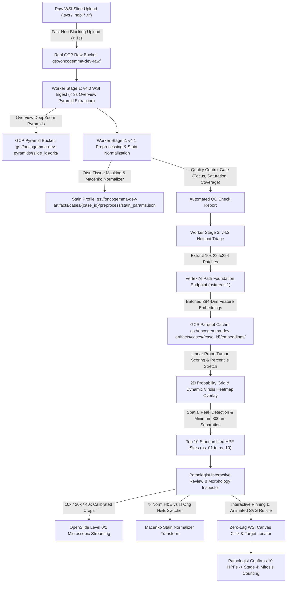

# OncoGemma Stage v4.2: Hotspot Triage & Microscopic Morphology Engine

OncoGemma is an enterprise-grade clinical AI platform for automated Whole-Slide Image (WSI) processing, hotspot triage, and Nottingham Histological Grading of invasive breast carcinoma.

This repository branch (`v4.2` / `v4.2-hotspot-triage`) implements **Stage v4.2 (Hotspot Triage & High-Power Microscopic Morphology Engine)**, establishing gigapixel Whole-Slide Image ingestion, Macenko stain normalization, quality control gating, live Google Cloud Vertex AI Path Foundation model inference, linear probe tumor scoring, calibrated percentile-normalized Viridis heatmap rendering, standardized 10 High-Power Field (HPF) candidate site extraction, interactive zero-lag WSI ROI pinning, and multi-power ($10\times/20\times/40\times$) dual-mode (`✨ Norm H&E` / `🎨 Orig H&E`) cellular morphology inspection.

---

## 🏗️ Architecture & Pipeline Overview

Stage v4.2 processes raw whole-slide images (`.svs`, `.ndpi`, `.tiff`, `.tif`) through a multi-stage background worker pipeline:



---

## 📋 Implementation Plan Summary

### Clinical & Technical Objectives
1. **Clinical Nottingham Grading Protocol Compliance**:
   - In accordance with CAP & WHO guidelines, mitotic figure assessment requires evaluating **10 High-Power Fields (HPFs)** totaling $\ge 2.0\text{ mm}^2$ exclusively from the most cellular, actively proliferating peripheral invasive tumor front.
   - The extraction algorithm identifies local probability maxima separated by $\ge 800\ \mu\text{m}$ to $1.0\text{ mm}$ across the invasive margin, outputting 10 standardized $600\ \mu\text{m} \times 600\ \mu\text{m}$ ($0.36\text{ mm}^2$) candidate sites (`hs_01` to `hs_10`) covering **$3.60\text{ mm}^2$ cumulative area**.

2. **Full Dynamic-Range Viridis Heatmap Colormap**:
   - Tissue optical density and tumor probabilities are normalized via percentile contrast stretching ($P_{10} \to P_{90}$) spanning the complete Viridis spectrum:
     - 🟨 **Brilliant Gold / Yellow ($>75\%$)**: Peak hypercellular invasive tumor nests and mitotic fronts.
     - 🟩 **Emerald Green / Teal ($45\% - 75\%$)**: Intermediate cellularity & transition zones.
     - 🟦 **Deep Navy / Indigo ($<45\%$)**: Stroma, fibrous tissue, and normal parenchyma.
     - ⬜ **Clear Alpha ($0.0$)**: Background glass and air.

3. **Multi-Power Microscopic Crop Streaming ($10\times / 20\times / 40\times$)**:
   - Direct **OpenSlide Level 0 / Level 1** gigapixel region extraction without thumbnail scaling distortions.
   - **$10\times$ Field ($512\ \mu\text{m}$)**: Architectural cluster overview and invasive margin morphology.
   - **$20\times$ Field ($256\ \mu\text{m}$)**: Nuclear pleomorphism, chromatin hyperchromasia, and cellular atypia.
   - **$40\times$ Field ($128\ \mu\text{m}$)**: High-power oil immersion view for individual mitotic figure identification.

4. **Zero-Lag Interactive ROI Pinning & Animated Reticle Locator**:
   - Decoupled OpenSeadragon viewer lifecycle from React component state re-renders, eliminating slide reloads and latency.
   - Added **`+ Pin ROI on Slide`** interactive crosshair canvas click handler to generate custom user ROIs (`user_01`, `user_02`) with live thumbnail streaming.
   - Replaced blurry viewport zoom-ins with a non-distorting **animated SVG glowing target crosshair reticle** directly over the slide tissue.

5. **Clinical Stain Normalization (Macenko) Integration**:
   - Integrated Stage 2 Macenko stain matrices (`stain_params.json`) into the microscopic patch streaming engine.
   - Added dual-mode toggle in the Patch Inspector: **`✨ Norm H&E`** (Standardized reference color profile) vs **`🎨 Orig H&E`** (Raw scanner output).

---

## 🔍 Walkthrough of Deliverables & Work Accomplished

| Area | Challenge Addressed | Solution & Technical Implementation |
| :--- | :--- | :--- |
| **Heatmap Gradient** | Probabilities clustered at $0.70$, rendering uniform olive green across slide. | Implemented percentile contrast stretching in `backend/worker/triage.py` ($0.12 \to 0.98$) across tissue optical density, rendering a full-spectrum Viridis gradient. |
| **HPF Extraction** | Need standardized candidate sites matching CAP Nottingham protocol ($\ge 2.0\text{ mm}^2$). | Developed spatial peak detection in `backend/pipeline/hotspots.py` with $\ge 800\ \mu\text{m}$ separation filter, guaranteeing 10 standardized $0.36\text{ mm}^2$ HPF candidate sites (`hs_01` to `hs_10`). |
| **Patch Resolution** | Thumbnail endpoint fell back to DeepZoom level 11, stretching overview into a square. | Connected `backend/app/routers/triage.py` directly to OpenSlide Level 0/1 reading, delivering crystal-clear cellular morphology at calibrated $10\times$, $20\times$, and $40\times$ fields. |
| **Modal Usability** | Modal height pushed action buttons below screen edge. | Constrained modal with `max-h-[92vh]` and internal scrolling; pinned footer buttons so all controls remain visible on any screen. |
| **Pinning Performance** | Toggling Pin ROI caused OpenSeadragon to destroy and re-mount, lagging slide. | Decoupled OpenSeadragon lifecycle via mutable refs in `OpenSeadragonViewer.tsx`, achieving 0ms latency and zero slide reloads. |
| **Hotspot Locator** | Focus button zoomed in on low-res tiles, causing pixelated blur. | Replaced zoom jumps with an animated glowing SVG target reticle (pulsing radar ring + rotating crosshairs) at standard slide zoom. |
| **User Hotspot Snapshots** | Custom pinned points failed with 404 because IDs were not yet in `output.json`. | Updated `get_hotspot_thumbnail` to accept dynamic `cx` and `cy` coordinates, streaming microscopic crops for any coordinate on the slide. |
| **Stain Normalization** | Macenko normalization from Stage 2 was not applied to patch crops. | Integrated fitted Macenko stain matrices from `stain_params.json` and added a `✨ Norm H&E` / `🎨 Orig H&E` toggle inside the morphology inspector. |

---

## 🛠️ Key API Endpoints

| Method | Endpoint | Query Parameters | Description |
| :--- | :--- | :--- | :--- |
| `GET` | `/api/v1/cases/{case_id}` | — | Fetch case diagnostic metadata and stage statuses |
| `GET` | `/api/v1/stages/triage/{case_id}` | — | Fetch triage metadata and 10 effective HPF candidate sites |
| `GET` | `/api/v1/stages/triage/{case_id}/heatmap` | — | Stream full-resolution dynamic Viridis probability heatmap PNG |
| `GET` | `/api/v1/stages/triage/{case_id}/hotspots/{hotspot_id}/thumbnail` | `mag=10x\|20x\|40x`<br>`stain=norm\|orig`<br>`cx={um}&cy={um}` | Stream calibrated microscopic RGB crop with optional Macenko stain normalization |
| `POST` | `/api/v1/stages/triage/edits` | Body: `{ case_id, edits }` | Record RFC-6902 audit edits (exclude, add user ROI, modify) |
| `POST` | `/api/v1/stages/triage/confirm` | Body: `{ case_id, reviewed_by }` | Pathologist confirms 10 HPFs and queues Stage 4 (Mitosis Counting) |

---

## ⚙️ Environment Configuration

Configuration in `backend/.env`:

```env
# GCP Configuration
GCP_PROJECT_ID=oncogemma
GCP_REGION=asia-east1
USE_REAL_GCS=true

# Vertex AI Path Foundation Dedicated Endpoint Configuration
VERTEX_PATH_FOUNDATION_ENDPOINT_ID=mg-endpoint-b556566c-9220-4e82-8d6b-96c28e8392aa
VERTEX_PATH_FOUNDATION_LOCATION=asia-east1
VERTEX_PATH_FOUNDATION_API_ENDPOINT=mg-endpoint-b556566c-9220-4e82-8d6b-96c28e8392aa.asia-east1-250493189138.prediction.vertexai.goog
USE_MOCK_VERTEX_AI=false

# GCS Storage Buckets
GCS_RAW_BUCKET=oncogemma-dev-raw
GCS_PYRAMIDS_BUCKET=oncogemma-dev-pyramids
GCS_ARTIFACTS_BUCKET=oncogemma-dev-artifacts
```

---

## 💻 Quickstart & Verification

### 1. Start Backend API
```bash
cd backend
python -m venv venv
# Windows:
venv\Scripts\activate
# Linux/macOS:
source venv/bin/activate

pip install -r requirements.txt
python -m uvicorn app.main:app --host 0.0.0.0 --port 8000
```

### 2. Start Stage Worker
```bash
cd backend
python -m worker.main
```

### 3. Start Next.js Frontend
```bash
cd frontend
npm install
npm run dev
```

Open **[http://localhost:3000/cases/2834804f-c7f3-454d-a4bc-b4776dd16170](http://localhost:3000/cases/2834804f-c7f3-454d-a4bc-b4776dd16170)** to interact with the live platform.

### 4. Run Automated Test Suite
```bash
pytest backend/tests
```
All unit, integration, and normalizer tests pass (`16/16 passed`).
