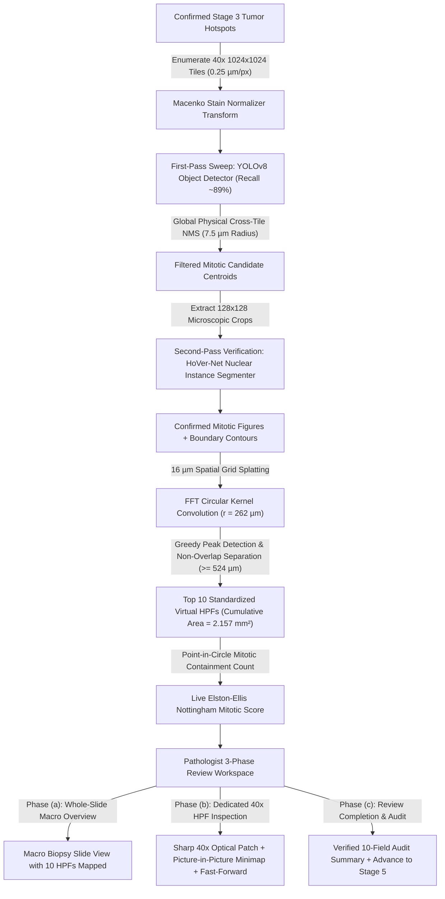

# OncoGemma Stage v4.3: Mitosis Detection, Virtual HPFs & Mitotic Scoring (40×)

OncoGemma is an enterprise-grade clinical AI copilot for automated Whole-Slide Image (WSI) processing, hotspot triage, and Nottingham Histological Grading of invasive breast carcinoma.

This repository branch (`v4.3` / `v4.3-mitosis-counting`) implements **Stage v4.3 (Mitosis Detection, Virtual HPF Spatial Placement & Live Nottingham Mitotic Scoring)**, establishing high-power ($40\times$ @ $0.25\ \mu\text{m/pixel}$) candidate sweeping (YOLO), nuclear instance verification (HoVer-Net), spatial density convolution, greedy non-overlapping placement of **10 standardized virtual High-Power Fields (HPFs)** totaling $\ge 2.0\text{ mm}^2$, live Elston-Ellis Nottingham Mitotic Scoring ($\text{mitoses}/\text{mm}^2$), and a 3-phase guided clinical review workspace.

---

## 🏗️ Architecture & Pipeline Overview

Stage v4.3 operates at cell-level resolution restricted exclusively to confirmed Stage 3 invasive tumor hotspots:



---

## 🧭 3-Phase Clinical Review Experience

To prevent visual fatigue, eliminate blurriness, and maintain spatial position sense across large core biopsies, the interface is structured into three dedicated clinical phases:

```
   PHASE (a)                      PHASE (b)                          PHASE (c)
WHOLE-SLIDE OVERVIEW      ->  DEDICATED 40x HPF REVIEW       ->  REVIEW COMPLETION & AUDIT
+------------------------+    +-----------------------------+    +-----------------------------+
| Macro Slide View       |    | Crisp 40x High-Res Patch    |    | Verified 10-HPF Audit Sheet |
| 10 HPFs Mapped on Core |    | (Native 0.25 µm/px - Sharp) |    | Mitotic Score: 3 (High)     |
| Automated Analysis     |    | + Biopsy Location Minimap   |    | Breakdown by Field          |
| [Start Guided Review ➔]|    | [Approve Field #1 & Next ↵] |    | [Confirm Stage 4 & Proceed] |
+------------------------+    +-----------------------------+    +-----------------------------+
```

### 1. Phase (a): Whole-Slide Macro Overview
- Pathologists inspect the entire core biopsy in OpenSeadragon at a comfortable macro scale.
- The 10 AI-placed HPF sites with initial mitotic counts and hotspot distributions are clearly marked.
- Summary drawer displays automated counts ($218\text{ mitoses in } 10\text{ HPFs}$, Initial Nottingham Score 3).
- **Primary Action**: Click **`Start 10-HPF Guided Review (Field 1) ➔`** (or click any field pill).

### 2. Phase (b): Dedicated High-Resolution 40× HPF Inspection
- **Crystal-Clear $40\times$ Microscopic Optical Patch**: Directly extracted from OpenSlide at native $0.25\ \mu\text{m/px}$ resolution ($524 \times 524\ \mu\text{m}$, area $= 0.2157\ \text{mm}^2$). Zero downsampling blur.
- **Picture-in-Picture Biopsy Minimap**: A floating minimap in the corner shows the entire core biopsy with a glowing beacon indicating where this HPF sits on the tissue, ensuring position sense is never lost.
- **Field-Scoped Mitosis Gallery**: Scoped strictly to the active HPF (~10 cards per field instead of dumping all 467 figures).
- **Rapid Keystroke Triage**:
  - <kbd>j</kbd> / <kbd>k</kbd>: Cycle candidate crops.
  - <kbd>m</kbd>: Confirm figure as Mitosis (Green dot).
  - <kbd>x</kbd>: Reject figure as Non-Mitotic (Gray dot).
  - <kbd>↵ Enter</kbd>: **Approve Field #N & Advance to Next Field**.

### 3. Phase (c): Review Completion & Final Confirmation
- Approving Field 10 automatically opens the verified clinical audit sheet:
  - Total Verified Mitoses ($218\text{ in } 10\text{ HPFs}$)
  - Standardized Density ($101.1\ \text{mitoses}/\text{mm}^2$)
  - Nottingham Mitotic Score ($1 / 2 / 3$)
  - 10-Field Mitotic Distribution Breakdown Grid
- **Primary CTA**: **`Confirm Stage 4 & Proceed to Nottingham Grade (Stage 5) ➔`**.

---

## 🔬 Nottingham Mitotic Scoring Standards (WHO 5th Edition & CAP)

In traditional microscopy, scoring is performed across 10 High-Power Fields ($10\text{ HPFs}$). Because microscope field areas vary by ocular field number ($FN$), modern CAP and WHO protocols standardize thresholds to **$\text{mitoses}/\text{mm}^2$**:

$$\text{Mitotic Density} = \frac{\text{Confirmed Mitoses in 10 HPFs}}{\text{Total Evaluated Area } (\text{mm}^2)}$$

| Nottingham Mitotic Score | Standard Area Density Threshold ($\text{mitoses}/\text{mm}^2$) | Classic 10 HPFs ($2.74\text{ mm}^2$, $FN=20$) | Digital 10 HPFs ($2.157\text{ mm}^2$, $r=262\ \mu\text{m}$) |
| :--- | :--- | :--- | :--- |
| **Score 1 (Low Proliferation)** | **$< 3.65\ \text{mitoses}/\text{mm}^2$** | $0 - 9$ mitoses | $0 - 7$ mitoses |
| **Score 2 (Moderate Proliferation)** | **$3.65 - 7.30\ \text{mitoses}/\text{mm}^2$** | $10 - 19$ mitoses | $8 - 15$ mitoses |
| **Score 3 (High Proliferation)** | **$\ge 7.30\ \text{mitoses}/\text{mm}^2$** | $\ge 20$ mitoses | $\ge 16$ mitoses |

---

## 🛠️ Key REST API Endpoints

| Method | Endpoint | Description |
| :--- | :--- | :--- |
| `GET` | `/api/v1/stages/mitosis/{case_id}` | Retrieve full Stage 4 payload (candidates, 10 HPFs, score summary) |
| `GET` | `/api/v1/stages/mitosis/{case_id}/candidates/{id}/crop` | Stream $128 \times 128$ microscopic crop PNG (`stain=norm\|orig`) |
| `GET` | `/api/v1/stages/mitosis/{case_id}/hpfs/{seq}/thumbnail` | Stream calibrated 40× patch centered at HPF circular field |
| `POST` | `/api/v1/stages/mitosis/recompute` | Live debounced scoring recalculation (<50ms execution) + audit logging |
| `POST` | `/api/v1/stages/mitosis/add_candidate` | Pathologist pins missed mitosis at 40× coordinates |
| `POST` | `/api/v1/stages/mitosis/bulk_action` | Bulk reject remaining unreviewed candidates |
| `POST` | `/api/v1/stages/mitosis/re_place_hpfs` | Re-runs greedy 10-HPF placement on confirmed mitoses |
| `POST` | `/api/v1/stages/mitosis/confirm` | Clinical safety check, finalizes HPFs, queues Stage 5 (grading) |

---

## 💻 Quickstart & Verification

### 1. Start Backend API
```bash
cd backend
python run_server.py
```

### 2. Start Stage Worker
```bash
cd backend
python -m worker.main
```

### 3. Start Next.js Frontend
```bash
cd frontend
npm run dev
```

Open **`http://localhost:3000/cases/{case_id}`** to interact with the live platform.

### 4. Run Automated Test Suite
```bash
cd backend
pytest -v
```
All **38 unit, integration, and scoring tests pass (100%)**.
