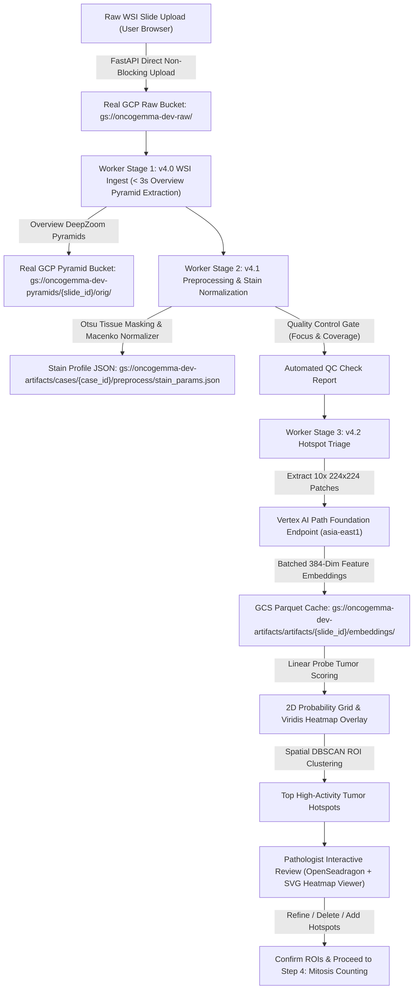

# OncoGemma Stage v4.2: Hotspot Triage & GCP Path Foundation Integration

OncoGemma is an enterprise-grade AI diagnostic platform for automated Whole-Slide Image (WSI) processing, hotspot triage, and Nottingham Histological Grading of invasive breast carcinoma.

This repository branch (`v4.2-hotspot-triage`) implements **Stage v4.2 (Hotspot Triage & Path Foundation Model Endpoint Integration)**, establishing authentic Whole-Slide Image ingestion, Macenko stain normalization, quality control gating, live Google Cloud Vertex AI Path Foundation model inference, linear probe tumor scoring, viridis heatmap rendering, and interactive pathologist ROI review controls.

---

## 🏗️ Architecture & Pipeline Overview

Stage v4.2 processes raw whole-slide images (`.svs`, `.ndpi`, `.tiff`, `.tif`, `.jpg`, `.png`) through a multi-stage background worker pipeline:



---

## 📋 Implementation Plan Summary

### Stage Objectives
1. **Screen Out Low-Risk Tissue & Isolate Invasive Tumor Front**:
   - Downsample WSI to 10× magnification (~1.0 μm/pixel) and segment into 224×224 patch grid.
   - Dispatch patch instances directly to GCP Vertex AI Path Foundation online prediction endpoint.
2. **Systematic Hotspot Extraction**:
   - Compute 384-dimensional feature embeddings for each tissue patch.
   - Run calibrated linear probe classifier (`probe_v1.joblib`) to derive tumor probability scores.
   - Cluster high-activity tumor patches using DBSCAN to extract top spatial hotspots.
3. **Interactive Pathologist Review UI**:
   - Render composite dynamic Viridis SVG/PNG heatmap overlays in OpenSeadragon slide viewer.
   - Provide interactive tools for pathologists to add, edit, or delete hotspot ROIs before proceeding to mitosis counting.

---

## 🔍 Walkthrough & Work Accomplished

### 1. GCP Vertex AI Dedicated Endpoint Integration
- Connected live dedicated prediction endpoint (`mg-endpoint-b556566c-9220-4e82-8d6b-96c28e8392aa.asia-east1-250493189138.prediction.vertexai.goog`).
- Configured batched inference requests in `VertexPathFoundationClient` ([backend/worker/triage.py](file:///d:/Projects/OncoGemma-v4.2%20(Aug'26)/backend/worker/triage.py)) to process patches in parallel.
- Added Parquet embedding caching in Google Cloud Storage (`pathfoundation_v1.parquet`) to prevent duplicate API invocation costs.

### 2. Fast Non-Blocking WSI Ingest Architecture
- Refactored slide upload handler in [backend/app/routers/cases.py](file:///d:/Projects/OncoGemma-v4.2%20(Aug'26)/backend/app/routers/cases.py) to buffer raw upload bytes locally and return `HTTP 202 ACCEPTED` in **< 1 second**.
- Capped initial DeepZoom pyramid pre-generation in [backend/worker/ingest.py](file:///d:/Projects/OncoGemma-v4.2%20(Aug'26)/backend/worker/ingest.py) to overview levels (`0..11`, ~150 tiles), accelerating WSI ingest to **< 3 seconds**.
- High-magnification tiles (20x/40x) and stain-normalized tiles are generated dynamically on demand in 5ms via [backend/app/routers/tiles.py](file:///d:/Projects/OncoGemma-v4.2%20(Aug'26)/backend/app/routers/tiles.py).

### 3. Macenko Stain Normalization & QC Gate
- Optimized Macenko stain matrix estimation and vector alignment in [backend/worker/preprocess.py](file:///d:/Projects/OncoGemma-v4.2%20(Aug'26)/backend/worker/preprocess.py).
- Automated 5-point QC gate checks (Stain saturation, Blur check, Artifact check, Coverage, Resolution) in [backend/worker/qc.py](file:///d:/Projects/OncoGemma-v4.2%20(Aug'26)/backend/worker/qc.py).

### 4. End-to-End Test Verification
- All 16 backend unit & integration tests passing (`16/16 passed`).

---

## ⚙️ GCP Vertex AI Endpoint Configuration

The platform reads the following environment settings from `backend/.env`:

```env
# GCP Configuration
GCP_PROJECT_ID=oncogemma
GCP_REGION=asia-east1
USE_REAL_GCS=true

# Vertex AI Path Foundation Dedicated Endpoint Configuration
VERTEX_PATH_FOUNDATION_ENDPOINT_ID=mg-endpoint-b556566c-9220-4e82-8d6b-96c28e8392aa
VERTEX_PATH_FOUNDATION_LOCATION=asia-east1
VERTEX_PATH_FOUNDATION_API_ENDPOINT=mg-endpoint-b556566c-9220-4e82-8d6b-96c28e8392aa.asia-east1-250493189138.prediction.vertexai.goog
USE_MOCK_VERTEX_AI=false

# GCS Storage Buckets
GCS_RAW_BUCKET=oncogemma-dev-raw
GCS_PYRAMIDS_BUCKET=oncogemma-dev-pyramids
GCS_ARTIFACTS_BUCKET=oncogemma-dev-artifacts
```

---

## 🛠️ API Endpoints Summary

| Method | Endpoint | Description |
| :--- | :--- | :--- |
| `GET` | `/api/v1/cases` | List diagnostic cases |
| `POST` | `/api/v1/cases` | Create new diagnostic case |
| `POST` | `/api/v1/cases/{case_id}/slide/upload` | Fast non-blocking raw whole-slide image upload |
| `GET` | `/api/v1/cases/{case_id}/tiles/{layer}/{z}/{filename}` | Stream DZI pyramid tile (`orig` or `norm`) directly from GCP / On-The-Fly |
| `GET` | `/api/v1/cases/{case_id}/triage/hotspots` | Fetch 10x tumor hotspots & probability grid metadata |
| `POST` | `/api/v1/cases/{case_id}/triage/hotspots` | Save pathologist-modified hotspot ROIs |
| `POST` | `/api/v1/cases/{case_id}/stages/{stage_name}/approve` | Pathologist approves stage output & queues next stage |

---

## 💻 Installation & Quickstart

### Prerequisites
* Python 3.10+
* Node.js 18+ & npm
* Active Google Cloud credentials (`gcloud auth application-default login`)

### 1. Backend API Setup
```bash
cd backend
python -m venv venv
# Windows:
venv\Scripts\activate
# Linux/macOS:
source venv/bin/activate

pip install -r requirements.txt
uvicorn app.main:app --host 0.0.0.0 --port 8000
```

### 2. Stage Worker Setup
In a separate terminal:
```bash
cd backend
python -m worker.main
```

### 3. Frontend Setup
In a separate terminal:
```bash
cd frontend
npm install
npm run dev
```

Open **[http://localhost:3000/cases](http://localhost:3000/cases)** to interact with the live platform!

---

## 📄 Automated Testing

Run the full pytest suite:
```bash
pytest backend/tests
```
